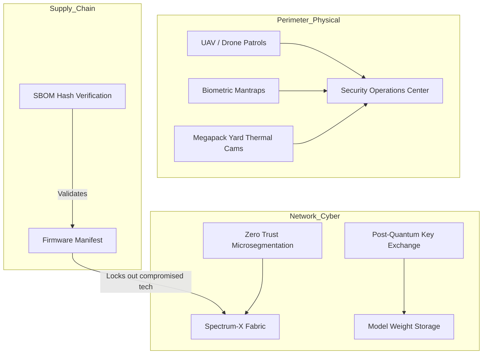

# xai-colossus-security

> **Physical & Cyber Defenses for Sovereign AI Infrastructure**

---

## 🛑 The Challenge: Defending the Apex Asset

Colossus 2 is not just a data center; it is a sovereign strategic asset. The models training inside (Grok 5+) represent intellectual property worth tens of billions.
- **Cyber Threats:** Nation-state actors attempting exfiltration of model weights or poisoning of the training data.
- **Physical Threats:** Disruption of the 1.5 GW power infrastructure, sabotage of the cooling loops, or unauthorized physical access to the compute floor.
- **Supply Chain:** Counterfeit microcode or compromised hardware inserted during the massive 555,000 GPU deployment phase.

---

## 🛡️ The Solution: Omnilayer Defense Architecture

This repository codifies the Zero Trust network policies, physical access schemas, and cryptographic pipelines that protect Colossus.

### 1. Cyber: Post-Quantum Cryptography & Zero Trust
- **Model Weight Encryption:** All model checkpoints and HBM memory states are encrypted at rest using AES-256-GCM, with key exchanges secured by **Kyber (ML-KEM)** post-quantum algorithms.
- **Zero Trust Fabric:** Every service, script, and engineer must re-authenticate continuously. Microsegmentation prevents lateral movement if a node is compromised.

### 2. Hardware: Supply Chain SBOM Verification
- Integrates directly with `xai-colossus-microcode`.
- Every BMC, switch, and GPU must present a cryptographically signed **Software Bill of Materials (SBOM)** (SPDX 2.3) upon ingestion. Counterfeit components are physically locked out of the NVLink fabric.

### 3. Physical: Autonomous Sentinel Integration
- **Biometric Mantraps:** Multi-factor biometric (iris + vein) required for data floor access.
- **Perimeter Defense:** Integration APIs for automated perimeter drone patrols and thermal imaging over the Megapack and Titan-350 turbine yards.

---

## 🗺️ Defense Topology

---

## 📊 Engineering Impact

| Threat Vector | Standard Data Center | Colossus Sovereign Security |
|---------------|----------------------|-----------------------------|
| **Model Exfiltration** | Perimeter Firewalls | **Post-Quantum Encryption / Zero Trust** |
| **Hardware Tampering** | Trust Vendor | **Cryptographic SBOM Audits** |
| **Physical Breach** | Badge Readers | **Iris Biometrics + Autonomous Patrols** |

---

## 🔐 About This Repository

Contains the Kubernetes network policies, physical access role mappings, and cryptography key rotation automation scripts.

Part of the [GlacierEQ xAI Engineering Suite](https://github.com/GlacierEQ/xai-colossus-community).  
*Absolute integrity. Zero compromise.*
